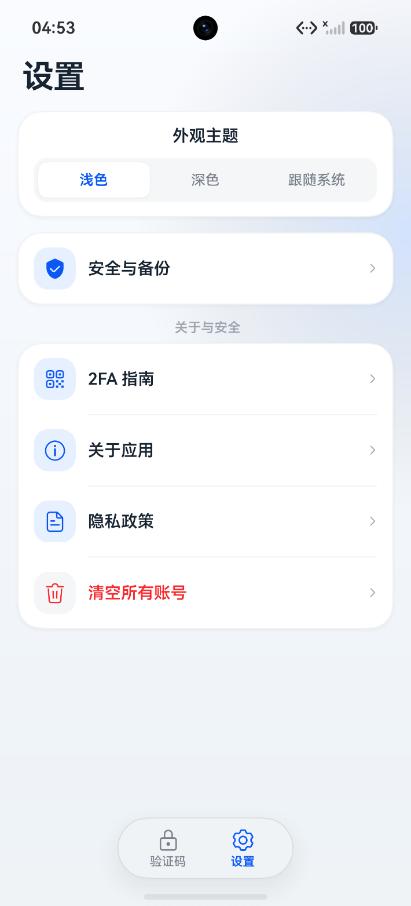
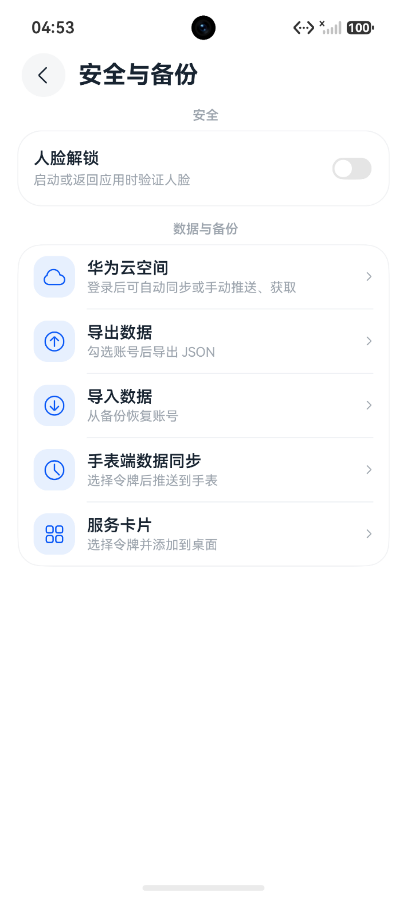
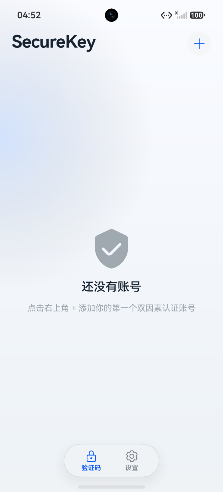
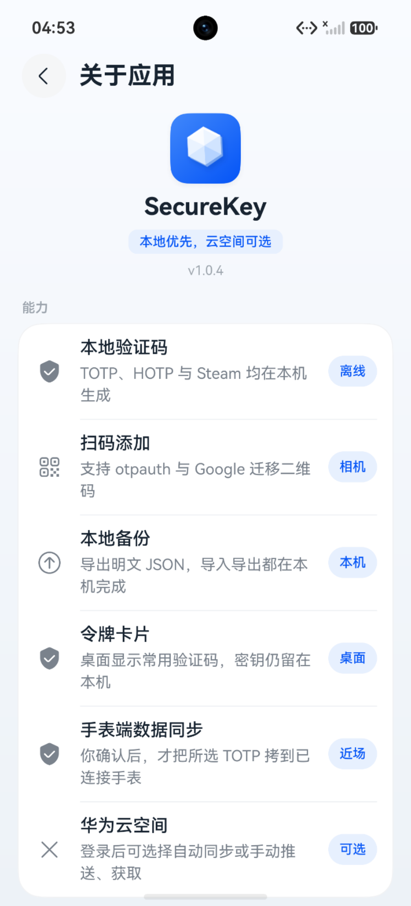
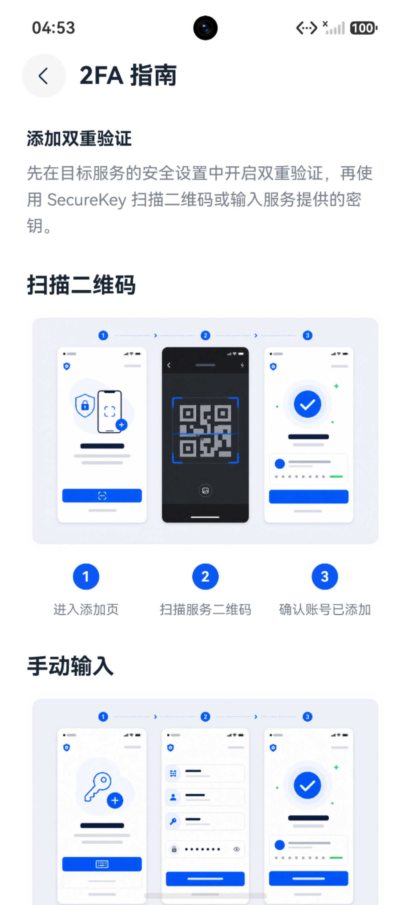

# 2FA验证器-工具

<p align="center">
  <strong>HarmonyOS 原生、本地优先的 2FA 验证器</strong>
</p>

<p align="center">
  <a href="https://github.com/agiledesign-ai/onekey-authenticator/stargazers"></a>
  <a href="https://gitee.com/agiledesign/onekey-authenticator-open-source"></a>
  <a href="https://gitcode.com/yunagile/onekey-authenticator"></a>
  <a href="LICENSE"></a>
</p>

在 HarmonyOS 上管理 TOTP、HOTP 和 Steam 一次性验证码。密钥默认保存在系统 Asset Store，验证码在设备本地计算。

当前版本：**1.0.5**（`versionCode` 1000005）

## 应用截图

> [!IMPORTANT]
> 第二、第四张来自原完整版本，画面包含手表同步入口。公开源码不包含穿戴设备和手表同步能力。第四张“关于应用”截图显示的是原版本 `v1.0.4`，首次公开源码版本为 `v1.0.5`。

<table>
  <tr>
    <td align="center"><br>设置</td>
    <td align="center"><br>安全与备份（原完整版本）</td>
    <td align="center"><br>验证码首页</td>
  </tr>
  <tr>
    <td align="center"><br>关于应用（原完整版本 v1.0.4）</td>
    <td align="center"><br>2FA 指南</td>
    <td></td>
  </tr>
</table>

## 功能

- 扫描 `otpauth` 或 Google Authenticator 迁移二维码。
- 手动添加 TOTP、HOTP 和 Steam 账号。
- 搜索、置顶、编辑和分组管理账号。
- 使用系统 Asset Store 保存密钥。
- 可选人脸解锁。
- 选择部分账号导出明文 JSON，并从备份导入。
- 将常用验证码添加为桌面服务卡片。
- 浅色、深色和跟随系统主题。
- 通过系统邮箱提交建议反馈。
- 保留华为云空间同步源码，公开构建默认关闭。

## 公开版边界

本仓库不包含：

- 穿戴设备应用。
- 手机向手表发送账号或验证码的实现。
- WearEngine 集成、路由、权限和测试。
- 原应用 Bundle Name、正式 Client ID、证书、Profile 或签名密码。

`otp_core` 继续保留，因为手机端 OTP 算法、Asset Store 和安全策略依赖它。该模块中的穿戴专用实现已经删除。

## 快速开始

### 环境要求

- DevEco Studio 6.1.1 Release
- HarmonyOS SDK 6.1.1（API 24）
- Node.js 20 或更高版本，用于源码合约测试

### 获取源码

```bash
git clone https://github.com/agiledesign-ai/onekey-authenticator.git
cd onekey-authenticator
ohpm install --all
node --test tests/*.test.mjs
```

使用 DevEco Studio 打开仓库，根据本机设备创建调试签名，然后构建 `entry` 模块。仓库不提供任何正式签名材料。

## 华为云空间

公开构建默认执行以下限制：

- `cloudStructuredDataSyncEnabled` 为 `false`。
- 不声明网络和分布式数据同步权限。
- 不包含 `client_id`。
- 不显示云空间入口，也不初始化云服务。

需要启用时，必须创建自己的 AppGallery Connect 应用并完成全部配置。参见[华为云空间配置指南](docs/cloud-space-setup.md)。不要提交自己的 Client ID 或签名材料。

## 数据与隐私

- 默认不发起业务网络请求，也不包含统计 SDK 或远程配置。
- 验证码在本机生成，密钥默认保存在系统 Asset Store。
- 桌面卡片会显示当前验证码，但不会保存明文密钥。
- 导出文件是明文 JSON。泄露备份文件等同于泄露 2FA 密钥。
- 不要在 Issue、Pull Request、日志或截图中提交真实密钥、二维码和备份。
- 请保留各服务提供的恢复码，避免设备损坏后无法登录。

## 1.0.5 更新

- 首次公开源码版本。
- 使用独立公开 Bundle Name。
- 移除穿戴设备和手表同步实现。
- 移除正式签名与原应用 Client ID。
- 华为云空间源码保留，但在公开构建中默认关闭。
- 纳入建议反馈页面。
- 增加 Apache-2.0、DCO、社区模板和开源边界检查。

## 测试

```bash
# Node 源码合约和公开边界
node --test tests/*.test.mjs
node scripts/open-source-audit.mjs

# ArkTS 单元测试
hvigorw test --mode module \
  -p module=entry@default \
  -p product=default \
  --no-daemon \
  --no-incremental
```

构建成功不代表已经完成真机、云空间或应用市场验证。相关变更应在支持的真机上单独验证。

## 贡献

请先阅读 [CONTRIBUTING.md](CONTRIBUTING.md) 和 [CODE_OF_CONDUCT.md](CODE_OF_CONDUCT.md)。

本项目使用 DCO。提交时请执行：

```bash
git commit -s -m "feat: describe your change"
```

安全漏洞请按照 [SECURITY.md](SECURITY.md) 私下报告，不要创建公开 Issue。

## 仓库关系

- 主仓库：[GitHub](https://github.com/agiledesign-ai/onekey-authenticator)
- 同步镜像：[Gitee](https://gitee.com/agiledesign/onekey-authenticator-open-source)
- 同步镜像：[GitCode](https://gitcode.com/yunagile/onekey-authenticator)

Issue、Pull Request 和版本发布以 GitHub 为准。

## 联系与定制

- 微信：`petalmailo`
- 邮箱：`halolion@petalmail.com`

添加微信时请说明来源、联系方式和咨询原因。可联系应用定制、项目合作与技术咨询。

## 许可证

项目代码依据 [Apache License 2.0](LICENSE) 开源。贡献者还需遵守 [DCO](DCO)。项目名称、图标、截图和作者身份不得用于暗示作者对衍生产品的背书。
